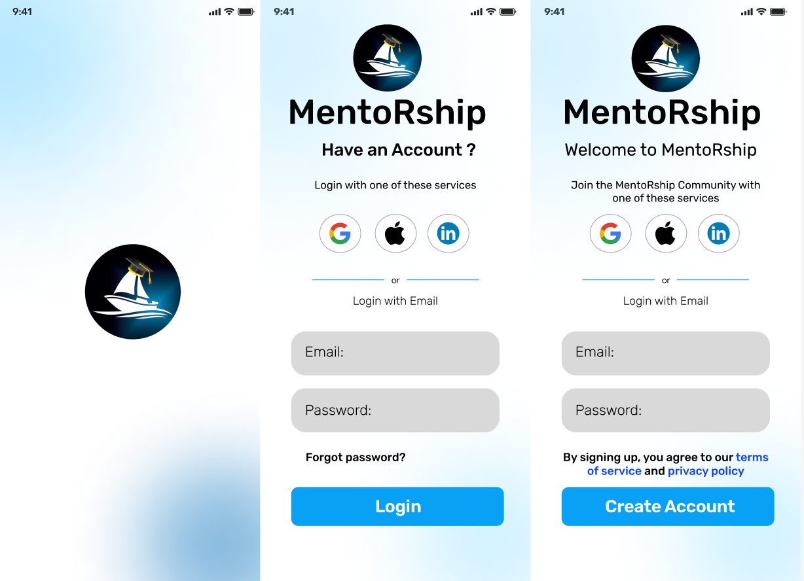

 

# MentoRship - Sail with your Mentor

### The project falls within the domain of mentorship and guidance, creating a app-based platform that facilitates meaningful connections between individuals seeking guidance and experienced mentors across various fields.

## 📋 <a name="table">Table of Contents</a>

1. 🤖 [Introduction](#introduction)
2. ⚙️ [Tech Stack](#tech-stack)
3. 🎯 [Objectives](#objectives)
4. 🔋 [Features](#features)
5. 🤸 [Quick Start](#quick-start)
6. 🕸️ [Snippets](#snippets)
7. 🔗 [Links](#links)
8. 🚀 [More](#more)

## <a name="introduction">🤖 Introduction</a>

MentoRship is a application designed to connect individuals seeking guidance
with experienced mentors from diverse fields. Users can create profiles, specifying their goals
and interests. The app's algorithm then matches them with suitable mentors based on
categories, ensuring a personalized mentorship experience. Users can choose mentors based
on ratings and preferences, initiate one-on-one chats, and schedule virtual meetings. The
platform also features live public sessions and Q&A sessions. Language filtering options and
user analytics enhance the overall user experience.

## <a name="tech-stack">⚙️ Tech Stack</a>

- React Native
- Node.js
- Express.js
- MongoDB
- JSON Web Token
- WebSocket
- WebRTC
- FCM (Firebase Cloud Messaging)
- Git
- Visual Studio Code
- Figma
- Tailwind CSS
- Redux
